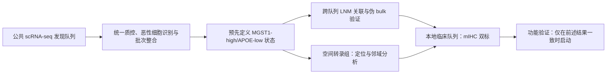

# 研究方案：界定并验证 PTC 中 MGST1-high / APOE-low 转移细胞状态及其空间免疫生态位

## 1. 拟题

中文：**MGST1-high/APOE-low 肿瘤细胞状态界定乳头状甲状腺癌淋巴结转移的代谢—免疫生态位：多队列单细胞、空间及临床验证研究**

英文：**A MGST1-high/APOE-low malignant-cell state delineates a metabolic–immune niche of lymph-node metastasis in papillary thyroid carcinoma**

## 2. 科学问题与假设

**主问题**：MGST1-high 与 APOE-low 是否标记同一、可重复识别的 PTC 恶性细胞状态；该状态是否在 LNM 病例及转移淋巴结中富集，并伴随免疫抑制和特定空间邻域？

**主假设 H1**：在至少两个独立 PTC scRNA-seq 队列中，可识别 MGST1-high/APOE-low 恶性细胞状态；其丰度在 LNM 阳性病例/转移 LN 高于 LNM 阴性原发灶，并独立关联 LNM。

**机制假设 H2**：该状态富集线粒体氧化还原、谷胱甘肽/脂质代谢、缺氧和 EMT/去分化程序，并在空间上邻近免疫抑制性髓系细胞和活化 CAF，而非仅反映坏死或低肿瘤纯度。

**负向/替代假设 H0**：MGST1-high 与 APOE-low 不属于同一稳定状态，或其关联完全由批次、肿瘤细胞比例、组织来源或分期混杂解释。

## 3. 研究设计概览

研究分两阶段。阶段 I 为可在现有生信条件下完成的发现与验证；阶段 II 为组织和功能验证。阶段 II 不应在阶段 I 失败时继续投入。

## 4. 数据与队列

| 模块 | 最低要求 | 推荐规模/构成 | 关键输出 |
|---|---|---|---|
| scRNA-seq 发现 | ≥2 个公开 PTC 数据集，均含病例级 LNM 或原发/LN 来源注释 | 每组至少 8 例；优先加入配对原发灶—LN 数据 | 状态丰度、转录程序、细胞通讯 |
| 空间验证 | ≥1 个含 PTC 与 LNM/高低风险分层的公开空间数据集 | 6+ 切片；尽量有独立患者 | 空间富集、邻域、配体—受体候选轴 |
| 本地 mIHC 队列 | 连续入组、术后病理明确 | 发现队列约 100 例；独立验证约 100 例，尽量使 LNM 阳性 ≥40 例/队列 | 双标状态与 LNM/复发关联 |
| 功能队列（条件启动） | PTC 细胞、类器官或 PDX | ≥3 个生物学重复；必要时 2 个模型 | 因果支持，不作为主要终点 |

### 纳入与排除

- 纳入：首次手术、病理确诊 PTC；LNM 状态有清晰病理记录；可获得足够临床协变量。
- 排除：既往放疗、系统性靶向/免疫治疗；无法确认 LNM；同一患者的重复标本仅保留预先规定的一个分析单位。
- 分层：经典 PTC 与高细胞亚型等亚型分别描述；不与 ATC/MTC 混合建模。

## 5. 预先规定的分析方案

### 5.1 单细胞质控与恶性细胞识别

1. 每个数据集独立执行细胞质控、双细胞去除和环境 RNA 处理；阈值按数据集分布预先记录，不能按 LNM 结果回调。
2. 以 CNV 推断、甲状腺上皮标志和原始作者标注的交集定义恶性细胞；保留“严格”和“宽松”两套定义做敏感性分析。
3. 在数据集内先聚类、注释、计算状态，之后再做整合；避免整合算法抹平病例差异。

### 5.2 联合状态的操作性定义

主定义：在恶性细胞中，MGST1 表达位于该患者恶性细胞分布上四分位数、且 APOE 位于下四分位数的细胞，记为 `MGA_state`。

稳健性定义：

- 基于 Z-score 的 `MGST1 z > 0.5` 且 `APOE z < -0.5`；
- 以 MGST1 与 APOE 各自的 AUCell/模块分数定义；
- 不使用二元阈值，而以连续联合分数 `z(MGST1)-z(APOE)` 建模。

只有主定义和至少一种稳健性定义方向一致，才称为“稳定联合状态”。

### 5.3 主要统计终点

**主要终点**：患者级 `MGA_state` 丰度与病理 LNM 的关联。

- 单细胞按患者伪 bulk：每位患者的 `MGA_state` 细胞数/全部恶性细胞数。
- 模型：Firth logistic 回归或混合效应 logistic 回归（数据集为随机效应）；协变量最低包括年龄、性别、原发灶大小、甲状腺外侵犯、BRAF 状态（若有）和肿瘤细胞数/比例。
- 报告 OR、95% CI、双侧 P 值和校准/判别指标；不以单独 AUC 作为主要证据。
- 多队列合并采用分数据集效应量的随机效应 meta-analysis；异质性以 I² 和预设来源探索报告。

**次要终点**：

1. 转移 LN 与原发灶中的状态丰度差异；优先做配对检验。
2. 与去分化、EMT、缺氧、氧化磷酸化、谷胱甘肽/脂代谢和 IFN-γ/抗原呈递模块的关联。
3. 与 Treg、耗竭 T 细胞、LAMP3+ DC、APOC1+ 巨噬细胞及 CAF 亚群丰度的病例级关联。
4. 与无复发生存的探索性关联；仅在随访充分且事件数合适时建模。

### 5.4 空间验证

- 在每张切片上进行 spot 去卷积或细胞映射，使用同一 `MGA_state` 基因程序而非单基因着色。
- 主要检验：状态高分区域与 APOC1+ 髓系细胞、POSTN+/RGS5+ CAF 和 CD8/Treg 空间邻近的置换检验；按患者汇总后比较，不能把 spot 当作独立患者。
- 对坏死、低 UMI、肿瘤密度和切片批次作敏感性调整。

### 5.5 本地组织验证

**检测**：mIHC/多重 IF，最低双标 MGST1 与 APOE；推荐增加 PAX8 或 CK19（肿瘤细胞定位）、CD68/APOC1（髓系）和 αSMA/POSTN（基质）。

**判读**：病理医师盲法判读；预先定义肿瘤区域、阳性阈值、双标指标（每 mm² 的 MGST1-high/APOE-low 肿瘤细胞比例），对 10% 切片重复判读并报告 ICC/Kappa。

**统计**：发现队列选定阈值，锁定后才用于独立验证队列。比较模型为临床病理基线模型 vs 基线 + 双标状态；报告似然比检验、校准曲线、决策曲线，不主张替代现行病理分期。

## 6. 功能验证：条件性 Aim 3

启动门槛：阶段 I 的跨队列关联与空间邻域均达到预设一致性。

1. 在至少两种 PTC 细胞模型中进行 MGST1 knockdown/CRISPRi，并分别过表达或敲低 APOE，检验是否存在交互而非独立主效应。
2. 终点：迁移/侵袭、anoikis、ROS/线粒体膜电位、Seahorse 代谢指标、TGF-β/IL-1β 分泌及免疫细胞趋化/共培养 readout。
3. 因果判据：遗传干预的方向与药理干预一致，且有 rescue 实验；Toxoflavin 只能作为辅助工具，不能仅凭药物效应归因于 MGST1。

## 7. 样本量与质量控制

- 本地双标的重点是稳健效应估计而非追求极高 AUC。若 LNM 比例约 40%，每队列 100 例可获得约 40 个事件，适合检验一个锁定的状态指标并谨慎调整有限协变量；若要建立含 5–6 个预测参数的模型，应扩充到至少 150–200 例/队列或降低模型复杂度。
- 任何阈值、基因集和模型选择均只在发现集完成一次；验证集保持盲态。
- 批次校正、细胞注释、LNM 缺失、亚型限制、肿瘤细胞比例、BRAF 状态和组织来源均进入敏感性分析表。
- 多重比较：通路和细胞通讯分析按 FDR < 0.05；主要终点只检验一个锁定假设。

## 8. 预期图表与论文结构

| 图/表 | 内容 |
|---|---|
| 图 1 | 研究流程、队列、纳排与每一步样本数 |
| 图 2 | 跨队列恶性细胞图谱及 MGA_state 的可重复识别 |
| 图 3 | 病例级状态丰度与 LNM 的调整后效应、各数据集森林图 |
| 图 4 | 伪时序/基因程序及代谢—免疫关联 |
| 图 5 | 空间定位、邻域和细胞通讯结果 |
| 图 6 | 本地 mIHC 图像、双标定量与独立验证 |
| 图 7（条件） | 遗传干预、rescue 与功能 readout |
| 表 1 | 所有数据集和本地队列临床特征 |
| 表 2 | 主要与敏感性分析结果 |

## 9. 风险、分流和停止规则

| 风险 | 预先处理 |
|---|---|
| MGST1 和 APOE 不共现 | 写成两条并行转移程序；比较其不同空间/免疫生态位，避免制造“联合亚群”。|
| 单细胞资料缺乏 LNM 注释 | 只用于状态再现，不用于主要关联；主要关联限于病例级注释完整的数据集。|
| 空间数据样本数小 | 作为机制支持，结论限定为探索性，并以患者级而非 spot 级统计。|
| mIHC 双标技术不稳 | 先做 20 例技术预实验，锁定抗体、阈值和判读流程后才进行正式队列。|
| 功能结果不支持 | 保留“关联性状态图谱”主线；不将药物/机制写成核心结论。|

## 10. 12 个月执行计划与最小可发表单元

| 月份 | 工作 | 交付物 |
|---|---|---|
| 1–2 | 数据登记、元数据清洗、分析计划冻结 | 数据字典、代码仓库、分析计划 |
| 2–4 | 单细胞复分析与跨队列验证 | 图 1–4 初稿、Go/No-go 决策 |
| 4–6 | 空间数据分析 | 图 5 初稿、mIHC panel 锁定 |
| 5–9 | 本地组织队列、双标与盲法判读 | 图 6、独立验证结果 |
| 9–12 | 条件性功能实验、成稿 | 完整稿或生信+组织验证稿 |

**最小可发表单元（MVP）**：两个独立单细胞队列的患者级复现 + 一个空间队列 + 一个独立 mIHC 队列。没有功能实验也可成稿，但标题和结论需限定为“state/niche associated with LNM”，而不是“drives metastasis”。

## 11. 报告规范、伦理与可重复性

- 观察性临床队列按 STROBE；预测性能若有则按 TRIPOD-AI/PROBAST-AI 的适用条目；单细胞分析按数据处理版本、过滤阈值和软件版本完整披露。
- 预先登记主假设、状态定义、主要模型与停止规则；分析代码、参数和匿名化的病例级汇总数据应在发表时共享。
- 人体标本应取得伦理批准和知情同意/豁免；动物实验仅在 Aim 3 启动后另行审批。
- AI 工具仅用于文献梳理与文本辅助，不替代原始数据分析、病理判读或作者责任。
